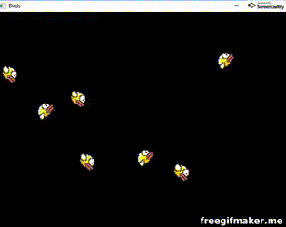
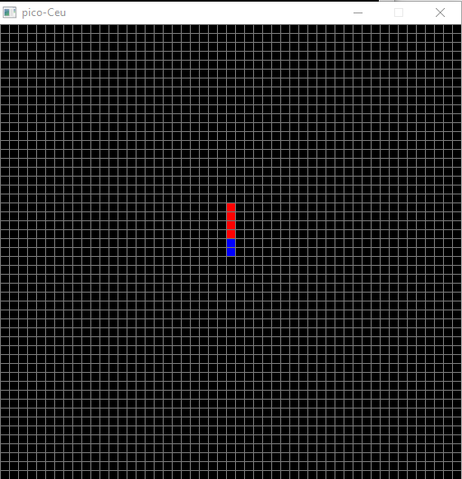
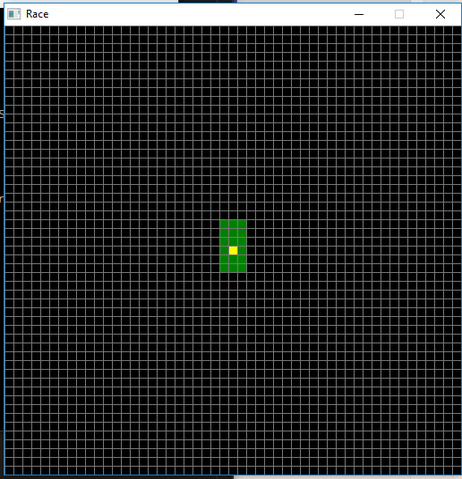
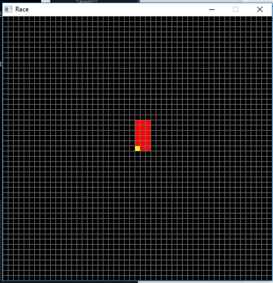

# Developing a game with pico-Céu from scratch

This tutorial will explain how to develop a race game using pico-Céu environment. It will cover graphics, parallel compositions and await statements. 
ToDo: Sumário and Gif

> pico-Céu is a tiny programming environment for visual and interactive applications such as video games. It is composed of the programming language Céu and minimalist libraries for input, graphics, network, and sound.

## Installation
First of all, you need to install pico-Céu. Simply download the last stable release of Céu-Maker from [https://github.com/ceu-lang/ceu-maker/releases](https://github.com/ceu-lang/ceu-maker/releases) and double click on the downloaded exe. Choose the destination folder in the installer window and click *Install*. When the installation complets, two folders, one containing the binary from pico-Céu and other the code examples will be opened. 

> Céu-Maker is a programming environment that integrates Céu-Arduino and pico-Céu in a single package for Windows.
Although it supports Céu-Arduino, this tutorial will only cover programming with pico-Céu

To test if everything worked fine, drag and drop a pico-ceu code example (```examples\pico-ceu\birds.ceu```, for example) to ```bin\pico-Céu.exe```. The result must be similar to the gif bellow.  



## Starting to code
Create a file anywhere in your computer and name it ```race.ceu```. Just pay attention if the path of your file contains any white spaces — this can generate bugs in the compilation process.

## Drawing pixels and rectangles

### Draw a pixel
To start coding our game, we need to figure out how to draw the car and the obstacles. Let's start with a pixel. The bellow code draw a pixel in the 0,0 position, witch, by default, correspond to the middle of the window. 

```c#
emit GRAPHICS_DRAW_PIXEL(0,0);
```


pico-Céu uses a grid system that, by default, initiates from -25 to 25 in both x-axis and y-axis. The first parameter of ```GRAPHICS_DRAW_PIXEL``` correspond to the coordinate of the x-axis and the second, of the y-axis.

### Draw multiple pixels and set its colors
The function ```GRAPHICS_DRAW_PIXEL``` can be applied in sequence to draw more pixels:

```c#
//set the paint color to blue
emit GRAPHICS_SET_COLOR_NAME(COLOR_BLUE);

//draw a rectangle pixel by pixel
emit GRAPHICS_DRAW_PIXEL(0, 0);
emit GRAPHICS_DRAW_PIXEL(0, 1);

//set the paint color to red
emit GRAPHICS_SET_COLOR_NAME(COLOR_RED);

emit GRAPHICS_DRAW_PIXEL(0, 2);
emit GRAPHICS_DRAW_PIXEL(0, 3);
emit GRAPHICS_DRAW_PIXEL(0, 4);
emit GRAPHICS_DRAW_PIXEL(0, 5);

```



The ```GRAPHICS_SET_COLOR_NAME``` function is responsible for defining the color with which the pixels will be drawn. It is quite similar to the real world painting process. The painter chooses an ink, soak the brush with it (GRAPHICS_SET_COLOR_NAME) and draws pictures with this color (GRAPHICS_DRAW_PIXEL). To draw pictures with another color, he cleans the brush and soak it with a new ink.

### Draw a rectangle
In the previus code, we draw a rectangle pixel by pixel. A shorter way to do that is use the function ```GRAPHICS_DRAW_RECT```. It receives as parameters the initial cordinates of the rectangle (x and y) and its width and height. The code below draw a green rectangle and a yellow pixel in its center. Note that we used a different function to set the yellow color. The ```GRAPHICS_SET_COLOR_RGB``` works very similar to the ```GRAPHICS_SET_COLOR_NAME```, but instead of defining the color by its name, it uses the [RGB code](https://en.wikipedia.org/wiki/RGB_color_model).

```c#
emit GRAPHICS_SET_COLOR_NAME(COLOR_GREEN);
emit GRAPHICS_DRAW_RECT(0, 0, 3, 6);

emit GRAPHICS_SET_COLOR_RGB(255, 255,0);
emit GRAPHICS_DRAW_PIXEL(0, 0);
```



### Change the anchor

As we have seen, the reference coordinates of the rectangle corresponds to its center. We can change this by defining an anchor.

```c#
emit GRAPHICS_SET_ANCHOR(HANCHOR_LEFT, VANCHOR_BOTTOM);
emit GRAPHICS_SET_COLOR_NAME(COLOR_RED);
emit GRAPHICS_DRAW_RECT(0, 0, 3, 6);

emit GRAPHICS_SET_COLOR_NAME(COLOR_YELLOW);
emit GRAPHICS_DRAW_PIXEL(0, 0);
```



The first line of the above code define where the reference cordinates should be located in the rectangle. In this case, we choose that it should be located in its left (```HANCHOR_LEFT```) bottom(```VANCHOR_BOTTOM```) corner. You can play with anchor positions to see the differences.
- The first parameter defines the position of the anchor horizontaly, and its possible values are:
    - ```HANCHOR_LEFT```
    - ```HANCHOR_CENTER``` (default)
    - ```HANCHOR_RIGHT```
- The second parameter defines the position of the anchor verticaly, and its possible values are:
    - ```VANCHOR_TOP```
    - ```VANCHOR_CENTER``` (default)
    - ```VANCHOR_BOTTOM```

## Styling the window
As we already saw, pico-Céu displays a Window with a grid system. We can customize its name, with the  ```WINDOW_SET_TITLE("New Name")```, define if the grid will be displayed or not, with the ```WINDOW_SET_GRID(yes or no)```, and set the width and height of the window and how many pixels will be displayed in the x-axis and y-axis, with the ```WINDOW_SET_SIZE(width, height, pixels in x-axis, pixels in y-axis)```.

The code bellow shows how we customize our window.
```c#
emit WINDOW_SET_TITLE("Race game");
emit WINDOW_SET_SIZE(40*20, 40*20, 40, 40);
emit WINDOW_SET_GRID(no);
```

Since the last two parameters of ```WINDOW_SET_SIZE``` function specify how many pixels should exist in a specific axis, and the firt two, the total size of each axis, the division of the third parameter by the first, and the fouth by the second must be exact.

Note that in the above example we defined the first two parameters of ```WINDOW_SET_SIZE``` as the multiplication of two numbers: the **size of each pixel** and the **number of pixels displayed in a specific axis**. This can be a clear way to interpret this function.

## Drawing the car and the obstacles
For this game, we'll use a rectangle to simulate the car, and red pixels to simbolize the obstacles. The below code show the static draw of the elements of the game. Note that the car rectangle receives a negative number for the y-axis position to move it to the bottom of the screen.

```c#
emit GRAPHICS_SET_ANCHOR(HANCHOR_CENTER, VANCHOR_BOTTOM);
emit GRAPHICS_SET_COLOR_NAME(COLOR_BLUE);
emit GRAPHICS_DRAW_RECT(0, -18, 3, 6);

emit GRAPHICS_SET_COLOR_NAME(COLOR_RED);
emit GRAPHICS_DRAW_PIXEL(-13, 2);
emit GRAPHICS_SET_COLOR_NAME(COLOR_RED);
emit GRAPHICS_DRAW_PIXEL(10, 20);
emit GRAPHICS_SET_COLOR_NAME(COLOR_RED);
emit GRAPHICS_DRAW_PIXEL(5, 11);
emit GRAPHICS_SET_COLOR_NAME(COLOR_RED);
emit GRAPHICS_DRAW_PIXEL(6, 15);
```


## Move a pixel
In our game, the pixels should move down to give the sensation that the car is in movement. Therefore, all the pixels should initiate in the same y-axis position(19) and, from time to time, this position should be decremented. The x-axis position can variate from -20 to 19, that corresponds to the limits of the Window.

To demonstrate how to code the movement, let's start moving only one pixel.

```c#
var integer y = 19;
every 150ms do
    if (y > -20) then
        y = y - 1;
    end

    emit GRAPHICS_SET_COLOR_NAME(COLOR_RED);
    emit GRAPHICS_DRAW_PIXEL(-13, y);
end


emit GRAPHICS_SET_COLOR_NAME(COLOR_GREEN);
emit GRAPHICS_DRAW_PIXEL(-10, 20);
```


In line 1, we define an integer variable to maintain the current position in the y-axis and set its initial value to 19. Next, we used an ```every``` construct to execute it's enclosed code every 150 milliseconds.
In line 5, we decrement the y position only if it's not on the bottom of the window yet.
Lines 8 and 9 are, as we already saw, responsable for setting the draw color and draw a pixel. The difference in that now we use the ```y``` variable in the ```GRAPHICS_DRAW_PIXEL``` instead of a static integer so it can draw its updated position.

ToDo: Gif


By running the above code, we can see some problems. The most notable is that the red pixel that we are trying to animate is not moving down, but drawing a line down. To solve this, we need to clean the current pixel before updating the y position and drawing it again on a new coordinate.

```c#
var integer y = 19;
every 150ms do
    //cleaning the old pixel
    emit GRAPHICS_SET_COLOR_NAME(COLOR_BLACK);
    emit GRAPHICS_DRAW_PIXEL(-13, y);    

    //updating the y postion
    if (y > -20) then
        y = y - 1;
    end

    //drawing a new pixel with updated y position
    emit GRAPHICS_SET_COLOR_NAME(COLOR_RED);
    emit GRAPHICS_DRAW_PIXEL(-13, y);
end
emit GRAPHICS_SET_COLOR_NAME(COLOR_GREEN);
emit GRAPHICS_DRAW_PIXEL(-10, 20);
```

A second problem is that the pixels that are drawn after ```every``` construct are not showing up. This occurs because ```every``` works as an infinite loop, that executes every 150 milliseconds. So, our code are stuck in this loop and never reaches the line 16 from the above code.

To solve this, we can enclose everything in a ```par``` composition, which executes two or more trails concurrently. In the code bellow we defined two trails, one between ```par do``` and ```with```, and another between ```with``` and ```end```, giving the sensation that both trails (one animating the red pixel and other drawing the green one) are executing at the same time.

```c#
par do
    var integer y = 19;
    var integer x = -13;
    every 150ms do
        //cleaning the old pixel
        emit GRAPHICS_SET_COLOR_NAME(COLOR_BLACK);
        emit GRAPHICS_DRAW_PIXEL(x, y);    

        //updating the y postion
        if (y > -19) then
            y = y - 1;
        end

        //drawing a new pixel with updated y position
        emit GRAPHICS_SET_COLOR_NAME(COLOR_RED);
        emit GRAPHICS_DRAW_PIXEL(x, y);
    end
with
    emit GRAPHICS_SET_COLOR_NAME(COLOR_GREEN);
    emit GRAPHICS_DRAW_PIXEL(-10, 20);
    
    //draw more pixels if you want
end
```
ToDo Gif:
https://youtu.be/C8EO0OByVdM

### "Copy and past" way
Ok, we animated one pixel and found a way to display the other ones, but our orinal idea was to have every pixel animated. One way of doing this, though rudimentary, would be to add one trail per pixel, which one beeing responsable to animate it.


```c#
par do
    var integer y = 19;
    var integer x = -13;
    every 150ms do
        //cleaning the old pixel
        emit GRAPHICS_SET_COLOR_NAME(COLOR_BLACK);
        emit GRAPHICS_DRAW_PIXEL(x, y);    

        //updating the y postion
        if (y > -19) then
            y = y - 1;
        end

        //drawing a new pixel with updated y position
        emit GRAPHICS_SET_COLOR_NAME(COLOR_RED);
        emit GRAPHICS_DRAW_PIXEL(x, y);
    end
with
    var integer y = 19;
    var integer x = 0;
    every 300ms do
        //cleaning the old pixel
        emit GRAPHICS_SET_COLOR_NAME(COLOR_BLACK);
        emit GRAPHICS_DRAW_PIXEL(x, y);    

        //updating the y postion
        if (y > -19) then
            y = y - 1;
        end

        //drawing a new pixel with updated y position
        emit GRAPHICS_SET_COLOR_NAME(COLOR_RED);
        emit GRAPHICS_DRAW_PIXEL(x, y);
    end
with
    var integer y = 19;
    var integer x = 5;

    await 3s;
    every 200ms do
        //cleaning the old pixel
        emit GRAPHICS_SET_COLOR_NAME(COLOR_BLACK);
        emit GRAPHICS_DRAW_PIXEL(x, y);    

        //updating the y postion
        if (y > -19) then
            y = y - 1;
        end

        //drawing a new pixel with updated y position
        emit GRAPHICS_SET_COLOR_NAME(COLOR_GREEN);
        emit GRAPHICS_DRAW_PIXEL(x, y);
    end
end
```

The above acode animate 3 pixels in 3 trails. We didn't modificate the first trail. The second one change its position every 300 milliseconds. The last one also have a different interval to update its position (200 milliseconds), but its most important part is the ```await``` statement, that makes the code await one second before proceeding to the next line. This makes the third trail waits 3 seconds before enter in the ```every``` construct, delaying the third pixel to appear.

Note, also, that all pixels start in a different x position.

ToDo: gif
https://youtu.be/5lR0R3ctgvc

### Enclosing the pixels in a code/await abstraction
We can see that the last code grows very quickly, and that it takes a lot of work to add a simple animation to three pixels. To avoid repetitive code, we can enclose the behavior of a pixel in a procedure abstration usign a ```code/await``` composition.

```c#
code/await Pixel(none) -> NEVER do
    var integer y = 19;
    var integer x = -13;
    every 150ms do
        //cleaning the old pixel
        emit GRAPHICS_SET_COLOR_NAME(COLOR_BLACK);
        emit GRAPHICS_DRAW_PIXEL(x, y);    

        //updating the y postion
        if (y > -19) then
            y = y - 1;
        end

        //drawing a new pixel with updated y position
        emit GRAPHICS_SET_COLOR_NAME(COLOR_RED);
        emit GRAPHICS_DRAW_PIXEL(x, y);
    end
end
```

In the first line we defined a Pixel abstraction using ```code/await```. The abstration don't receive any parameters (because of that we use the ```none```) and ```NEVER``` ends. We can notice that by the ```every``` compositon, witch, as already mentioned in this tutorial, runs infinitely, like an infinite loop.

## Make the pixel position random 
With the Pixel abstraction, our pixels would appear in the same x position. Let's make it's x position random.

To do that, we can use the C++ function ```rand``` to choose a number beetween -20 and 19 (respectively, the leftmost and the rightmost pixel of the Window).
```c#
code/await Pixel(none) -> none do
    var integer y = 19;
    var integer x = {rand()%40 - 20};
    // hidden code
end
```
The code between the curly braces are native c code. In this case, the C code result is stored in the Céu x variable. To read more about the Céu C integration, check the [Céu online manual](https://ceu-lang.github.io/ceu/out/manual/v0.30/statements/#c-integration) and the section 3.3 of [this paper](http://www.ceu-lang.org/chico/ceu_sensys13_pre.pdf)

## Calling the Pixel abstraction

Now, we can call the Pixel abstration how many times we want, needing only to specify where these pixels will reside in memory.
```c#
//add this code after the code/await declaration
pool[3] Pixel pixels;
spawn Pixel() in pixels;
await FOREVER;
```

ToDo: gif
https://youtu.be/5lR0R3ctgvc

In the second line, we created a pool to serve as a container for 3 code-await instances. In the next line we spawned a Pixel instance and saved it in the pool. The spawn primitive starts the procedure to execute in the background. Since the spawn doesn't block, the code will proceed to the next line and we'll reach the ```await FOREVER`` statement, that will keep the application alive.

## Trying to spawn in a full pool
However, if we try to spawn more than 3 pixels, we'll notice that the last one will not be created. This occurs because our pool is full. 

```c#
//add this code after the code/await declaration
pool[3] Pixel pixels;
spawn Pixel() in pixels;
spawn Pixel() in pixels;
spawn Pixel() in pixels;
spawn Pixel() in pixels;
await FOREVER;
```

Note that the pixels never finallize, even when they reaches the end of the screen. Because of that a pool position will never be released, preventing more pixels to be allocated. Let's change our procedure abstraction to finalize when a pixel reaches the end of the screen.

## Making Pixel abstraction finalize
```c#
code/await Pixel(none) -> none do
    var integer y = 19;
    var integer x = {rand()%40 - 20};
    every 150ms do
        //cleaning the old pixel
        emit GRAPHICS_SET_COLOR_NAME(COLOR_BLACK);
        emit GRAPHICS_DRAW_PIXEL(x, y);    

        //updating the y postion
        if (y > -19) then
            y = y - 1;
        else
           break;
        end

        //drawing a new pixel with updated y position
        emit GRAPHICS_SET_COLOR_NAME(COLOR_RED);
        emit GRAPHICS_DRAW_PIXEL(x, y);
    end
end
```

The first change was in the line 1, where we substitute ```-> NEVER``` to ```-> none```. This means that the code-await abstration will no longer execute forever and will not return anything. The other change was the addition of the lines 12 and 13, that breaks the "every" infinite loop when the pixel reaches the bottom of the screen.
Now, when a pixel reaches the bottom of the screen, the break will stop the "every" loop, and consequently finalize the procedure and release a position in the pool.

## Trying to spawn 4 pixels again
After this modification, let's check if now we can include one more pixel in the pool.

```c#
await 7s;
pool[3] Pixel pixels;

spawn Pixel() in pixels;
spawn Pixel() in pixels;
spawn Pixel() in pixels;
spawn Pixel() in pixels;

await FOREVER;
```

ToDo: gif

As we can see, the last pixel do not apear in the execution. This occurs because when we try to spawn the last pixel, no one reached the bottom of the screen yet, so we didn't have space in the pool. Logically, let's wait a little time before trying to spawn a forth pixel. 5 seconds should be enough.

```c#
await 7s;
pool[3] Pixel pixels;

spawn Pixel() in pixels;
spawn Pixel() in pixels;
spawn Pixel() in pixels;
awaits 5s;
spawn Pixel() in pixels;

await FOREVER;
```

ToDo: gif

### Make the pixel spawns more dinamic
We figured out how to animate four pixels. But what we should do to animate more ones? We could add more lines of code, attempting to whether the pool has free space. But in our game the pixels should never stops to appear. If we want to keep this way of programming, our code should be infinity, what is obviously impossible.

A way to solve this, is use a construct to spawn a Pixel from time to time.

```c#
pool[3] Pixel pixels;

every 1s do
    spawn Pixel() in pixels;
end
```

Note that we don't need the ```await FOREVER``` anymore, because the application in stucked in the every infinite loop.

Executing this code we can see that the pool is small for the quantity of pixels we are trying to spawn in it. The gaps in which should appear a pixel, the application simply don't spawn anything because of the lack of space. 
In other words, every 1 second the application tries to spawn a Pixel in the pool, but sometimes there is no free space.

We can increase the size of the pool (a pool of 6 positions should be enough) or even create an unbounded pool: ```c# pool[] Pixel pixels;```, that can stores how many Pixel the computer memory supports. For this tutorial, let's proceede with an unbounded pool.

## Creating a Car procedure abstraction
We can also enclose the car in a code/await abstraction. Even don't having multiple cars in our application, we can take advantage from a procedure abstraction enclosing all behaviour related to the car in a single place.

The Car procedure abstration has some similarities with the Pixel. The code bellow also have the definition of the integer variables x and y, in this case carring the default values of the car and an "every" loop that enclose the clean, update and draw code, but in this case the "every" runs every time a keyboard key is pressed by the user. The pressed key is stored in the integer variable ```key```, that is initiated with an empty value (```_```).

In the UPDATE, we check if the pressed key was the arrow left or the arrow right. All other keyboard keys are irrelevant to our application. If the user clicks a left key, the car should move left, so the x position is decremented. If the right key is clicked, the x position is incremented. The "ifs" in lines 14 and 18 ensures that the car do not move off the screen. Finally, as we did in the Pixel procedure, the x and y variables are used in the DRAW section to draw an updated graphic, in this case a rectangle.

```c#
code/await Car(none) -> NEVER do
    var integer x = 0;
    var integer y = -10;

    var integer key = _;

    every key in KEY_PRESS do
        //CLEAN
        emit GRAPHICS_SET_COLOR_NAME(COLOR_BLACK);
        emit GRAPHICS_DRAW_RECT(x, y, 3, 6);

        //UPDATE
        if key == KEY_LEFT then
            if (x > -19) then
                x = x - 1;
            end
        else/if key == KEY_RIGHT then
            if (x < 18) then
                x = x + 1;
            end
        end

        //DRAW
        emit GRAPHICS_SET_ANCHOR(HANCHOR_CENTER, VANCHOR_BOTTOM);
        emit GRAPHICS_SET_COLOR_NAME(COLOR_BLUE);
        emit GRAPHICS_DRAW_RECT(x, y, 3, 6);
    end
end

```

## Creating the colisions
Finally, let's implement the collision between the pixels and the car rectangle. In Pixel procedure, let's 
